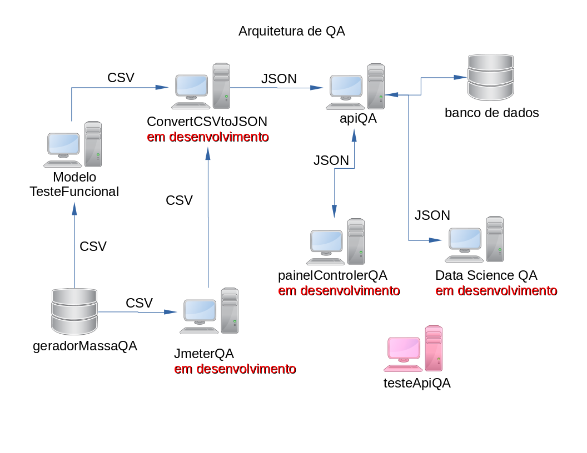

# Teste Api QA

>  Teste Api QA, faz parte de um projeto de arquitetura de QA.

> __Mais Informações sobre a Arquitetura QA__

>	Email = marcosregato01@gmail.com  
>	Assunto = Arquitetura QA

> __Descrição do projeto__

>	Faz um teste simple como POST, GET, UPDATE e DELETE para um API

> __Ferramenta de desenvolvimento__

>  Java 8

# Links dos projetos da arquitetura

> __Modelo Teste Funcional__
> [GitHub Pages](https://github.com/marcosregato/modeloTesteFuncional). 

> __Painel Teste Angular__
> [GitHub Pages](https://github.com/marcosregato/painelTesteAngular). 

> __Teste API QA__
> [GitHub Pages](https://github.com/marcosregato/testeApiQA). 

> __convert CSV to JSON__
> [GitHub Pages](https://github.com/marcosregato/convertCSVtoJSON). 

> __Data Science QA__
> [GitHub Pages](https://github.com/marcosregato/dataScienceQA). 

> __Api QA__
> [GitHub Pages](https://github.com/marcosregato/apiQA). 

> __Gerador massa de dados QA__
> [GitHub Pages](https://github.com/marcosregato/geradorMassaQA). 

# testeApiQA
